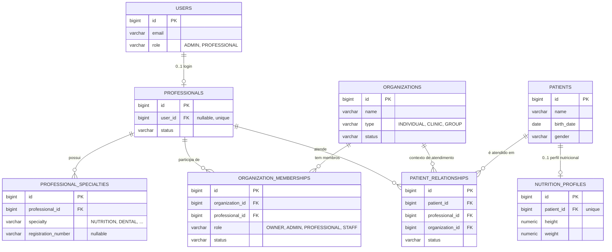

# Auditoria Arquitetural — Core SaaS Nuvexa

> Documento de análise apenas. Nenhum código, migration, entidade ou configuração foi alterado ao produzir este documento. Todas as recomendações aguardam autorização explícita antes de qualquer implementação.

---

## 1. Estado atual

```
com.nuvexa
├── platform/                    infraestrutura transversal (config, security, exception, persistence)
├── core/
│   ├── identity/                User, Role (ADMIN, PROFESSIONAL)
│   └── patient/                 PatientCore, Gender
└── verticals/
    └── nutrition/                NutritionProfile, Goal, ActivityLevel, calculadoras
```

Conceitos que existem hoje:

| Conceito | O que é hoje |
|---|---|
| `User` | Conta de login. `id, name, email, password, role, enabled, resetToken*`. Implementa `UserDetails`. |
| `Role` | Nível de acesso de sistema: `ADMIN`, `PROFESSIONAL`. Usado só para restringir `DELETE /patients/{id}` a `ADMIN`. |
| `PatientCore` | Identidade genérica do paciente: `name, birthDate, gender`. Tabela `patients`. |
| `NutritionProfile` | Dados clínicos de nutrição: `height, weight, goal, activityLevel, manualDailyCalories, notes`. `@OneToOne` unidirecional para `PatientCore`. |

O que **não existe** hoje: `Professional`, `Organization`, `Membership`, qualquer relacionamento `Professional↔Patient` ou `Organization↔Patient`, qualquer conceito de especialidade, qualquer permissão granular.

---

## 2. Problemas arquiteturais atuais

1. **Nenhum dono para `PatientCore`.** Qualquer conta autenticada (`PROFESSIONAL` ou `ADMIN`) lê, cria, edita e lista todos os pacientes do sistema. Isso é aceitável hoje (uso único, sem dados reais), mas é estruturalmente incompatível com a visão de múltiplos profissionais/clínicas.
2. **`Role` está fazendo dois trabalhos ao mesmo tempo.** Hoje `ADMIN` é usado como "quem pode excluir um paciente" — mas isso é uma decisão de **nível de organização** (um dono de clínica deveria poder excluir pacientes da própria clínica), não uma decisão de **nível de plataforma** (que é o que `Role` deveria representar). A regra atual é um substituto temporário para uma autorização que ainda não existe de verdade.
3. **Não existe conceito de "equipe" ou "contexto de atendimento".** Não há como representar uma clínica com vários profissionais, um profissional em duas clínicas, ou um paciente atendido em contextos diferentes — porque não existe nada entre `User` e `PatientCore`.
4. **`PatientCore` não tem nenhum relacionamento com quem quer que seja.** Isso é uma vantagem hoje (nenhuma FK a desfazer) e será o ponto de partida limpo para os relacionamentos corretos.

---

## 3. Conceitos necessários (visão de médio prazo)

| Conceito | Necessário? | Por quê |
|---|---|---|
| `User` | Já existe, mantém-se — só precisa de escopo mais estrito (seção 5). | Autenticação é um problema resolvido e correto hoje. |
| `Professional` | **Sim** | É a identidade de negócio de quem presta cuidado — hoje inexistente, misturada dentro de `User`. |
| `Organization` | **Sim** | É o único jeito de representar clínica, consultório ou profissional autônomo com o mesmo modelo. |
| `Membership` | **Sim** | É o que torna `Professional↔Organization` N:N com papel e status — sem isso, "profissional em duas clínicas" e "admin de clínica" não existem. |
| `PatientCore` | Já existe, mantém-se **sem alteração de forma**. | Continua sendo a identidade única do paciente na plataforma. |
| `Professional↔Patient` | **Sim**, via entidade própria (`PatientRelationship`). | É o que permite um paciente ser atendido por vários profissionais/especialidades/clínicas sem duplicar o paciente. |
| `Organization↔Patient` | **Derivado**, não uma tabela própria. | Ver seção 11 — uma tabela direta duplicaria fonte de verdade com `PatientRelationship`. |

---

## 4. Conceitos que NÃO devemos criar ainda

- **Role por especialidade** (`ROLE_NUTRITIONIST`, `ROLE_DENTIST`...) — rejeitado explicitamente. Especialidade é dado de negócio de `Professional`, não nível de acesso.
- **Editor de permissões dinâmico/customizável** — um mapeamento fixo `MembershipRole → Set<Permission>` no código é suficiente por muito tempo; um sistema de permissões configuráveis por organização é prematuro.
- **`Organization` com hierarquia de filiais/grupos (parent-child)** — mencionado como extensão natural futura (`type = GROUP`), mas não modelar agora.
- **Paciente como `User` (portal do paciente)** — arquiteturalmente compatível com o modelo abaixo (ver seção 5), mas fora do escopo atual.
- **Snapshot de especialidade dentro de `PatientRelationship`** — a especialidade é derivável de `Professional` no momento da consulta; guardar uma cópia histórica é otimização prematura.
- **Tabela própria `OrganizationPatient`** — o dado é 100% derivável de `PatientRelationship`; criar as duas é abrir espaço para inconsistência.

---

## 5. Modelo `User`

**O que deve permanecer em `User`:** tudo que é estritamente autenticação/credencial — `email`, `password`, `role` (nível de acesso de plataforma), `enabled`, `resetTokenHash`/`resetTokenExpiresAt`, timestamps. `name` pode continuar em `User` como "nome de exibição da conta" — é um atributo que qualquer tipo de conta precisa (profissional, staff, e futuramente paciente com portal), não é exclusivo de `Professional`.

**O que não deveria estar em `User`:** qualquer dado de negócio clínico ou profissional — registro de conselho (CRM/CRN/CRO), especialidade, status de atuação. Isso pertence a `Professional`.

**`User` deve representar somente identidade/autenticação?** Sim. `User` = "uma credencial que pode entrar no sistema". Ele não deveria saber nada sobre clínica, especialidade ou paciente.

**`User` deve ter relação 1:1 obrigatória com `Professional`?** **Não.** A relação deve ser **0..1**, e nos dois sentidos:
- Nem todo `User` é um `Professional` (uma conta de staff/recepção sem CRM, ou futuramente uma conta de paciente com acesso ao portal).
- Nem todo `Professional` precisa ter um `User` no momento em que é cadastrado (um admin de clínica pode pré-cadastrar um profissional antes dele criar login próprio).

**Uma conta pode representar outros tipos de usuário no futuro?** Sim — a mesma tabela `users` pode logar um profissional, um membro de staff, ou (futuramente) um paciente via portal. Isso só funciona se `User` permanecer genérico e as relações (`Professional.userId`, e futuramente `Patient.userId`) forem opcionais e vivam do lado do conceito de negócio, não do lado de `User`.

Isso evita exatamente a mistura que você quer evitar: `User` não conhece `Professional`, `Professional` é quem opcionalmente aponta para um `User`.

---

## 6. Modelo `Professional`

**Deve existir `core.professional`?** Sim, conceitualmente — não criado nesta etapa.

```
Professional
- id
- userId        (FK → users, NULLABLE, UNIQUE — 0..1)
- name           (ou herdado do User vinculado, quando existir)
- status         (ACTIVE, INACTIVE, PENDING)
- createdAt / updatedAt
```

**Especialidade, registro profissional (CRM/CRN/CRO), múltiplas especialidades:** não devem ser campos soltos em `Professional`. Um profissional pode ter mais de uma especialidade, e cada especialidade tem seu próprio número de registro (um CRN de nutricionista e um CRM de médico são coisas diferentes, com órgãos emissores diferentes). O modelo correto é uma entidade filha:

```
ProfessionalSpecialty
- id
- professionalId   (FK)
- specialty         (enum: NUTRITION, DENTAL, OPHTHALMOLOGY, MEDICAL, PHYSIOTHERAPY, ...)
- registrationNumber   (nullable — nem toda especialidade exige registro)
- registrationState    (nullable, ex.: UF do conselho)
- createdAt / updatedAt
UNIQUE(professionalId, specialty)
```

**Onde vive o enum `Specialty`?** Em `core` (não em nenhuma vertical) — pela mesma razão que `Gender` foi movido para `core.patient` no P1B: se `Specialty.NUTRITION` vivesse dentro de `verticals.nutrition`, então `core.professional` teria que depender de uma vertical para descrever um profissional, violando a regra `core` ↛ `verticals` que já está em vigor no projeto.

**Sem Role por especialidade — como isso substitui o que uma Role faria?** `Role` continua dizendo "isto é uma conta ADMIN de plataforma ou uma conta PROFESSIONAL comum". `Specialty` diz "este profissional atua em nutrição, odontologia, etc." — são eixos ortogonais. Um profissional com `Role = PROFESSIONAL` e `specialty = NUTRITION` tem exatamente os mesmos direitos de sistema que um com `specialty = DENTAL`; a diferença está em **quais dados de vertical ele tem relação** (via `PatientRelationship`, seção 10), não em nível de acesso.

---

## 7. Modelo `Organization`

**`Organization` deve ser "empresa jurídica"?** Não — essa é a suposição que você pediu para não assumir, e a análise confirma que seria errado. `Organization` deve representar **o contexto operacional sob o qual um profissional atua**, seja ele uma clínica com CNPJ, um consultório individual, ou um profissional autônomo sem nenhuma personalidade jurídica separada de si mesmo.

```
Organization
- id
- name          (nome de exibição — "Clínica Bem Estar" ou "Dra. Ana Nutricionista")
- legalName     (nullable — razão social, só relevante para type = CLINIC)
- document      (nullable — CNPJ ou CPF, dependendo do type)
- type          (enum: INDIVIDUAL, CLINIC, GROUP)
- status        (ACTIVE, SUSPENDED, ...)
- createdAt / updatedAt
```

`legalName` e `document` são **opcionais por natureza**, não por preguiça de modelagem — um profissional autônomo (`type = INDIVIDUAL`) pode nunca precisar preencher nenhum dos dois até o dia em que precisar emitir nota fiscal.

`type = GROUP` (múltiplas unidades/filiais) fica mencionado como extensão natural (`Organization` com `parentOrganizationId` auto-referenciado), mas **não deve ser modelado agora** — não há necessidade real hoje (regra que você mesmo tem aplicado em todas as etapas anteriores).

---

## 8. Modelo `Membership`

**Precisamos de `OrganizationMembership`?** Sim, é o elo que faltava.

```
OrganizationMembership
- id
- organizationId   (FK)
- professionalId   (FK)
- role              (enum: OWNER, ADMIN, PROFESSIONAL, STAFF)
- status            (ACTIVE, INACTIVE)
- createdAt / updatedAt
UNIQUE(organizationId, professionalId)
```

**Papéis de membership (diferentes de `Role` de sistema):**

| Papel | Significado |
|---|---|
| `OWNER` | Criou a organização, controla faturamento/transferência de posse. |
| `ADMIN` | Gerencia profissionais e memberships da organização, não necessariamente atende pacientes. |
| `PROFESSIONAL` | Atende pacientes dentro desta organização. |
| `STAFF` | Acesso operacional (agenda, dados básicos), sem acesso a dados clínicos completos — cenário 8. |

Essa é a peça que resolve "profissional em duas clínicas com papéis diferentes": um `Professional` pode ter um `OrganizationMembership(role=OWNER)` na própria organização e um `OrganizationMembership(role=PROFESSIONAL)` em outra — cenário 6.

---

## 9. Profissional autônomo — comparação e decisão

**Cenário:** nutricionista sozinho, sem clínica, sem outros profissionais.

| Abordagem | A — Auto-criar Organization (mesmo para 1 pessoa) | B — Professional pode existir sem Organization |
|---|---|---|
| Modelo de tenant | Único, uniforme: **tudo** sempre passa por Organization | Dois modelos coexistindo: às vezes tenant é Organization, às vezes é Professional "solto" |
| Faturamento futuro | Sempre a mesma entidade (Organization) recebe cobrança, solo ou clínica | Precisa de lógica bifurcada: "se tem org, cobra a org; senão, cobra o profissional" |
| Consultas/autorização | Uma única regra: sempre filtrar por Organization do membership | Toda consulta precisa de um branch "e se não houver Organization?" |
| Custo | Uma linha "invisível" a mais por profissional solo | Nenhum custo de dado extra, mas custo de complexidade permanente no código |

**Decisão recomendada: Abordagem A.** Toda conta profissional, mesmo autônoma, recebe automaticamente uma `Organization` (`type = INDIVIDUAL`) no momento em que se torna `Professional`, com um `OrganizationMembership(role=OWNER)` para si mesma. Isso mantém **um único modelo de tenant** em todo o sistema — que é exatamente o que valida (e não invalida) sua preferência inicial de "Organization = tenant" (seção 12). A abordagem B pareceria mais "enxuta" à primeira vista, mas na prática obriga o sistema inteiro a saber lidar com dois formatos de tenant diferentes para sempre — o tipo de bifurcação que este projeto tem evitado deliberadamente desde o P0.

---

## 10. Modelo `PatientCore` — pertencimento

**`PatientCore` deve ter FK direta para `Organization` ou `Professional`?** **Não, nenhuma das duas.** Isso é confirmado pelo próprio cenário 5 que você propôs: o mesmo paciente é atendido por um nutricionista da Clínica A e um dentista da Clínica B. Se `patients` tivesse uma coluna `organization_id` (ou `professional_id`), esse cenário exigiria duplicar o paciente como dois registros diferentes — quebrando a ideia de "uma identidade de paciente única na plataforma" e fragmentando o histórico clínico da mesma pessoa.

`PatientCore` deve continuar **independente**, exatamente como está hoje — sua única mudança de "pertencimento" acontece através de uma entidade de relacionamento (seção 11), nunca por FK direta.

Isso confirma diretamente sua preocupação: `patients.professional_id` limitaria o futuro e não deve ser feito.

---

## 11. Relacionamento Professional ↔ Paciente

**Precisamos de entidade própria?** Sim — é a peça mais importante de toda esta auditoria, porque é ela que resolve simultaneamente os cenários 4, 5 e 9.

```
PatientRelationship
- id
- patientId         (FK → patients)
- professionalId     (FK → professionals)
- organizationId     (FK → organizations)
- status             (ACTIVE, INACTIVE)
- createdAt / updatedAt
UNIQUE(patientId, professionalId, organizationId)
```

Por que `organizationId` também está na relação, e não só `professionalId`: porque o mesmo par (paciente, profissional) só faz sentido dentro de um contexto organizacional específico — é o que permite diferenciar "nutricionista atendeu este paciente na Clínica A" de um hipotético "esse mesmo nutricionista atenderia o mesmo paciente também na Clínica B" (cenário 6 combinado com 5).

**Cardinalidade:** `patients` 1—N `patient_relationships` N—1 `professionals`, e `patient_relationships` N—1 `organizations`. Isso é, na prática, um N:N entre paciente e profissional, mediado por organização.

Isso resolve:
- Um paciente atendido por vários profissionais (várias linhas, mesmo `patientId`).
- Um profissional atendendo vários pacientes (várias linhas, mesmo `professionalId`).
- Mesmo paciente, especialidades diferentes, mesma clínica (várias linhas, mesmo `organizationId`, `professionalId` diferente) — cenário 4.
- Mesmo paciente, clínicas diferentes (várias linhas, `organizationId` diferente) — cenário 5.
- Profissional sai da clínica (a linha correspondente vira `INACTIVE`, sem apagar nada, e sem afetar as linhas do paciente com outros profissionais) — cenário 9.

Essa entidade é a extensão natural, em escala maior, da decisão já tomada e aprovada por você no P1B: **excluir um relacionamento nunca deve apagar a identidade compartilhada** (`PatientCore` ali, `PatientRelationship` aqui).

---

## 12. Relacionamento Organization ↔ Patient

**`Organization` deve ter relacionamento direto com `PatientCore`?** Não como tabela própria — deve ser **derivado** de `PatientRelationship` (`SELECT DISTINCT patientId WHERE organizationId = X`). Criar uma tabela `OrganizationPatient` paralela duplicaria a fonte de verdade e abriria espaço para as duas ficarem dessincronizadas.

**O mesmo `PatientCore` pode pertencer a múltiplas Organizations?** **Sim, precisa poder.** Já confirmado pelo cenário 5.

**Vantagens:** continuidade de identidade (uma pessoa é uma pessoa só na plataforma, não uma por clínica que visita), histórico único, base para a futura camada de Inteligência/IA correlacionar dados entre verticais com consentimento.

**Riscos — privacidade e isolamento:** este é o ponto mais delicado de todo o modelo. O que pode ser compartilhado entre organizações e o que não pode:

| Dado | Compartilhado entre organizações? |
|---|---|
| `PatientCore` (nome, data de nascimento, gênero) | Sim — é a mesma pessoa, é esperado que Clínica A e Clínica B vejam que se trata do mesmo João. |
| `NutritionProfile` (e futuros perfis clínicos por vertical) | **Não.** Dados clínicos só são visíveis para quem tem um `PatientRelationship` ativo com aquele paciente **naquela organização específica**. |

A aplicação disso é 100% responsabilidade do backend: nenhuma consulta a dado clínico pode buscar por `patientId` sozinho — sempre precisa passar por `PatientRelationship` filtrado pelas organizações às quais o solicitante pertence (via `OrganizationMembership` ativo).

---

## 13. Modelo de Multi-tenancy

| Opção | Avaliação |
|---|---|
| A) `Organization` como tenant | Cobre faturamento, isolamento de dados clínicos, papéis administrativos (dono, admin, staff) — mas sozinha não explica "quem, dentro do tenant, pode fazer o quê". |
| B) `Professional` como tenant | Não consegue expressar nada organizacional (equipe, admin de clínica, staff, faturamento por clínica) — teria que reintroduzir Organization por cima de qualquer forma, então é estritamente pior que A. |
| C) `Organization` + `Membership` | `Organization` define a **fronteira de isolamento de dados** (o tenant); `Membership` define **quem, dentro dessa fronteira, pode agir e como**. |

**Conclusão: sua preferência inicial (Organization = tenant) está correta, mas incompleta sozinha — o modelo real é a opção C.** `Organization` isolada não basta porque não diz quem dentro dela é dono, admin, profissional ou staff; `Membership` isolado não basta porque não define a fronteira de dados. Juntos, resolvem exatamente o problema.

---

## 14. Modelo de autorização

Três eixos, propositalmente separados:

```
Role (sistema, já existe)        MembershipRole (por organização)      Permission (ação atômica)
─────────────────────────        ──────────────────────────────        ──────────────────────────
ADMIN                             OWNER                                  PATIENT_READ_BASIC
PROFESSIONAL                      ADMIN                                  PATIENT_READ_CLINICAL
                                   PROFESSIONAL                           PATIENT_CREATE
                                   STAFF                                  PATIENT_UPDATE
                                                                          PATIENT_DELETE
                                                                          SCHEDULE_READ
                                                                          SCHEDULE_WRITE
                                                                          MEMBERSHIP_MANAGE
                                                                          ...
```

**Como se relacionam:**
- `Role` continua sendo o nível de plataforma — hoje decide praticamente nada relevante para dados clínicos; no futuro decide acesso a ferramentas administrativas da própria Nuvexa (não da clínica de um cliente).
- `MembershipRole` decide, **dentro de uma organização específica**, um conjunto padrão de `Permission` — via um mapeamento fixo no código (`MembershipRole → Set<Permission>`), não um editor dinâmico.
- `Specialty` é ortogonal a tudo isso — não concede nem restringe `Permission`; ela determina **a quais dados de vertical** um `PROFESSIONAL` tem relação de fato, através de `PatientRelationship`. Um `PROFESSIONAL` de nutrição e um de odontologia têm o mesmo conjunto de `Permission`; a diferença é puramente em quais pacientes/perfis eles têm vínculo.

**Refinamento necessário identificado pelo cenário 8:** a lista de permissões proposta no seu enunciado (`PATIENT_READ`, `PATIENT_CREATE`...) precisa separar `PATIENT_READ_BASIC` (nome, contato, agenda) de `PATIENT_READ_CLINICAL` (perfil de nutrição, notas) — senão não é possível expressar "recepcionista vê agenda e dados básicos, mas não o prontuário".

**Ponto pendente de decisão:** hoje `DELETE /patients/{id}` exige `Role.ADMIN` (nível de plataforma). Quando `Membership`/`Permission` existirem, essa regra provavelmente deveria migrar para `Permission.PATIENT_DELETE`, concedida a `MembershipRole.OWNER`/`ADMIN` **dentro da organização daquele paciente** — não mais a um `ADMIN` global de plataforma. Isso é uma mudança de comportamento real e precisa de aprovação explícita quando chegar a hora.

---

## 15. Modelo de especialidades

Já detalhado na seção 6 — resumo: `Specialty` é um enum vivendo em `core` (não em nenhuma vertical), `ProfessionalSpecialty` é a entidade de junção que permite múltiplas especialidades por profissional, cada uma com seu próprio número de registro. Especialidade nunca vira `Role`.

---

## 16. Diagrama completo das entidades



---

## 17. Estrutura de pacotes recomendada

```
com.nuvexa
├── platform/                (inalterado)
├── core/
│   ├── identity/             (inalterado — User, Role)
│   ├── professional/          NOVO — Professional, Specialty, ProfessionalSpecialty
│   ├── organization/          NOVO — Organization, OrganizationMembership, MembershipRole
│   └── patient/               PatientCore, Gender (inalterados) + PatientRelationship (NOVO)
└── verticals/
    ├── nutrition/              (inalterado)
    ├── dental/                 (futuro, fora de escopo)
    └── ophthalmology/          (futuro, fora de escopo)
```

`PatientRelationship` fica em `core.patient` (não em um pacote novo) porque é uma extensão direta do que já vive ali — evita criar um módulo inteiro (`core.care`) para uma única entidade sem outra necessidade real hoje. Nenhuma dependência nova de `core → verticals` é introduzida; `core.organization` e `core.professional` não precisam saber que `verticals.nutrition` existe.

---

## 18. Estrutura de banco recomendada

| Tabela | Nova? | Cardinalidade principal |
|---|---|---|
| `users` | Existente, sem alteração | — |
| `patients` | Existente, sem alteração | — |
| `nutrition_profiles` | Existente, sem alteração | 1:1 com `patients` |
| `professionals` | **Nova** | 0..1 com `users` (FK nullable, unique) |
| `professional_specialties` | **Nova** | 1:N com `professionals` |
| `organizations` | **Nova** | — |
| `organization_memberships` | **Nova** | N:N entre `professionals` e `organizations` |
| `patient_relationships` | **Nova** | N:N entre `patients` e `professionals`, mediado por `organizations` |

Nenhuma tabela existente precisa de coluna nova nem de alteração de schema — todas as adições são tabelas novas, aditivas, no mesmo espírito expand/contract já usado no P1B.

---

## 19. Estratégia de migração do sistema atual

**Dados existentes hoje:** `users` (com `role = PROFESSIONAL` já migrado), `patients`, `nutrition_profiles` — sem nenhuma FK entre eles.

**Passo a passo conceitual (não implementado agora):**

1. Para cada `User` com `role = PROFESSIONAL`: criar um `Professional` (`userId = user.id`, `status = ACTIVE`).
2. Para cada `Professional` recém-criado: criar uma `Organization` (`type = INDIVIDUAL`, `name` derivado do nome do usuário) — aplicando a decisão da seção 9 (toda conta ganha uma organização, mesmo solo).
3. Criar `OrganizationMembership(organization = a criada no passo 2, professional = ele mesmo, role = OWNER, status = ACTIVE)`.
4. Para `Patient`/`NutritionProfile` existentes: este é o passo que exige uma decisão sua, porque **hoje não existe nenhum dado de propriedade histórica** — qualquer profissional podia ver qualquer paciente, então não há como saber com certeza "quem realmente atende quem":
   - **Se hoje só existe um profissional de fato usando o sistema** (cenário provável, ambiente de desenvolvimento): associar todos os pacientes existentes a esse único profissional/organização via `PatientRelationship`. Simples, seguro, sem ambiguidade.
   - **Se existir mais de um profissional com pacientes que não deveriam ser compartilhados**: não inventar a relação — isso seria pior que deixar em aberto. A alternativa segura é vincular todos os pacientes pré-existentes a uma organização "padrão"/"legado" e disponibilizar (em uma etapa de produto futura, não nesta migração) uma tela para os profissionais reivindicarem/redistribuírem seus pacientes manualmente.

**Reversibilidade:** toda a migração é puramente aditiva — nenhuma tabela existente (`users`, `patients`, `nutrition_profiles`) é alterada ou perde dados. Se algo desse errado, as tabelas novas (`professionals`, `organizations`, `organization_memberships`, `patient_relationships`) podem ser dropadas sem qualquer impacto nos dados já existentes — o mesmo princípio de segurança já validado no P1B.

---

## 20. Análise dos 10 cenários

| # | Cenário | Como o modelo resolve |
|---|---|---|
| 1 | Nutricionista autônomo, 100 pacientes | 1 `Professional`, 1 `Organization(INDIVIDUAL)`, 1 `Membership(OWNER)`, 100 `PatientRelationship`. |
| 2 | Clínica com 5 nutricionistas, 500 pacientes | 1 `Organization(CLINIC)`, 5 `Membership`, até 500+ `PatientRelationship` distribuídas entre os 5. |
| 3 | Clínica multidisciplinar (nutri + dental + oftalmo) | 1 `Organization`, memberships com profissionais de `ProfessionalSpecialty` diferentes — `Organization` não é amarrada a uma especialidade. |
| 4 | Paciente atendido por nutri e dentista da mesma clínica | 2 `PatientRelationship` (mesmo `patientId`, mesmo `organizationId`, `professionalId` diferente). |
| 5 | Paciente atendido por nutri da Clínica A e dentista da Clínica B | 2 `PatientRelationship` (mesmo `patientId`, `organizationId` diferente) — só possível porque `PatientCore` não tem FK fixa para organização. |
| 6 | Profissional trabalha em duas clínicas | 1 `Professional`, 2 `OrganizationMembership` (organizações diferentes, papéis potencialmente diferentes). |
| 7 | Admin da clínica gerencia profissionais | `MembershipRole = ADMIN/OWNER` concede `Permission.MEMBERSHIP_MANAGE` dentro daquela organização. |
| 8 | Recepcionista vê agenda e dados básicos, não clínicos | `MembershipRole = STAFF` → `Permission.SCHEDULE_*` + `PATIENT_READ_BASIC`, sem `PATIENT_READ_CLINICAL`. |
| 9 | Profissional sai, pacientes continuam da clínica | `Membership.status = INACTIVE`; `PatientRelationship` daquele profissional pode ficar inativa ou ser reatribuída, sem afetar `PatientCore` nem as relações com outros profissionais. |
| 10 | Paciente sai da clínica, mas continua existindo na Nuvexa | A(s) `PatientRelationship` daquela organização viram `INACTIVE`/são removidas; `PatientCore` é preservado — extensão direta da decisão já aprovada no P1B. |

Todos os 10 cenários são resolvidos sem exceção nem gambiarra — sinal forte de que o modelo tem a forma certa.

---

## 21. Riscos

| Risco | Mitigação |
|---|---|
| Atribuição retroativa incorreta de pacientes existentes a profissionais (seção 19, passo 4) | Só migrar automaticamente quando houver certeza (um único profissional real); caso contrário, exigir reconciliação manual — nunca inventar histórico. |
| Crescimento de complexidade — 5 tabelas novas de uma vez | Implementar em ordem incremental (seção 23), cada etapa compilando/testando antes da próxima — mesma disciplina já usada do P0 ao P1B. |
| Mudança de comportamento real quando a filtragem por `PatientRelationship` entrar em vigor | Hoje qualquer conta vê todos os pacientes; esse comportamento **precisa** mudar — deve ser comunicado como correção intencional de uma lacuna já mapeada desde a auditoria original, não como regressão. |
| Custo de consulta (joins extras em toda leitura de paciente) | Índices em `patient_relationships(patient_id)`, `(professional_id)`, `(organization_id)` — irrelevante na escala atual, mas vale planejar desde já. |
| Confusão entre `Role` (sistema) e `MembershipRole` (organização) para quem for implementar depois | Nomear de forma inconfundível (`Role` vs `MembershipRole`, nunca reaproveitar os mesmos valores) e documentar a distinção explicitamente no código. |

---

## 22. Decisões que precisam ser tomadas antes de implementar

1. **Confirmar a abordagem A da seção 9** — toda conta profissional, mesmo autônoma, ganha automaticamente uma `Organization` própria.
2. **Confirmar que `PatientCore` nunca terá FK direta para `Organization` ou `Professional`** — todo pertencimento passa por `PatientRelationship` (seção 10/11).
3. **Escolher a estratégia de backfill dos pacientes existentes** (seção 19, passo 4) — depende do estado real dos dados no momento da implementação.
4. **Decidir quando a regra `DELETE` exige `Role.ADMIN` deve migrar para `Permission.PATIENT_DELETE` via `MembershipRole`** — imediatamente junto com `Membership`, ou em uma etapa posterior?
5. **Validar a lista inicial de `Permission`** — a proposta desta auditoria já separa `PATIENT_READ_BASIC` de `PATIENT_READ_CLINICAL` (necessário para o cenário 8); precisa da sua confirmação antes de virar código.
6. **Confirmar o local de `PatientRelationship`** — `core.patient` (recomendado) versus um pacote dedicado `core.care`.

---

## 23. Ordem recomendada de implementação (quando autorizado)

1. `core.organization` — entidade `Organization` + migration aditiva. Sem mudança de comportamento.
2. `core.professional` — `Professional` + `ProfessionalSpecialty`. Sem mudança de comportamento.
3. Migration de bootstrap: criar `Professional`/`Organization`/`Membership(OWNER)` para cada `User` com `role = PROFESSIONAL` existente hoje.
4. `OrganizationMembership` (papéis `OWNER/ADMIN/PROFESSIONAL/STAFF`).
5. `PatientRelationship` + estratégia de backfill definida na decisão pendente #3.
6. Atualizar `PatientService`/`PatientController` para filtrar consultas por `PatientRelationship` das organizações do solicitante — este é o passo que **muda comportamento observável** (deixa de expor todos os pacientes a todos).
7. Introduzir o `Permission` explícito e o mapeamento `MembershipRole → Set<Permission>`, substituindo a regra atual "`DELETE` exige `Role.ADMIN`" por uma checagem de `Permission.PATIENT_DELETE` no escopo da organização.
8. Só então: refinamentos de UI/roteamento por `Specialty`, separação `STAFF` básico vs. clínico completo (cenário 8) e, eventualmente, a segunda vertical.

---

**Fim da auditoria.** Nenhuma alteração foi feita no código, banco, migrations ou frontend. Aguardando autorização para qualquer próxima etapa.
